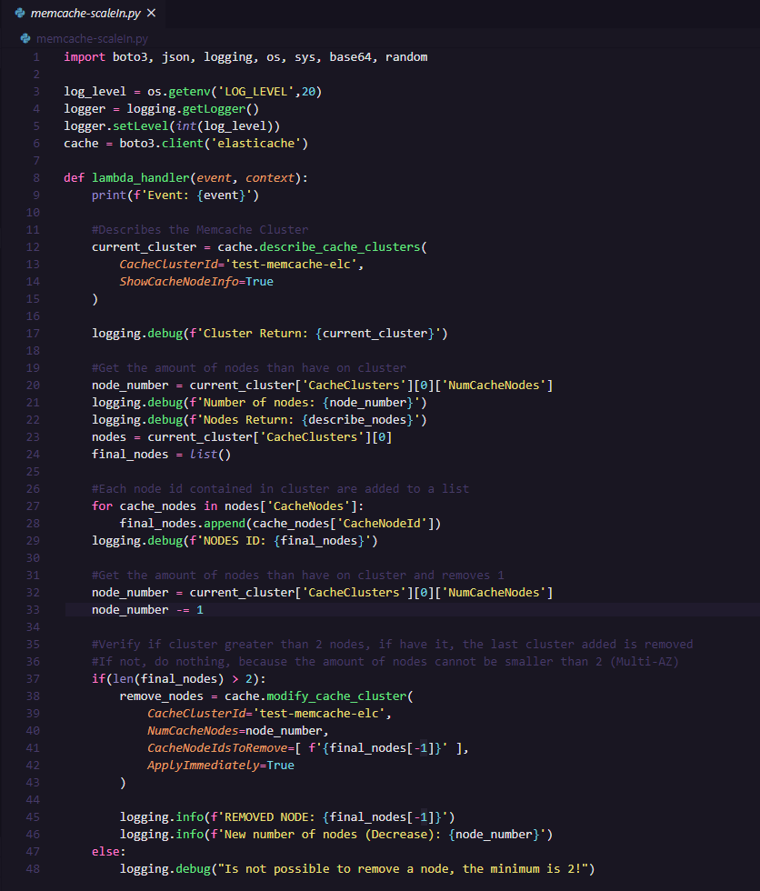
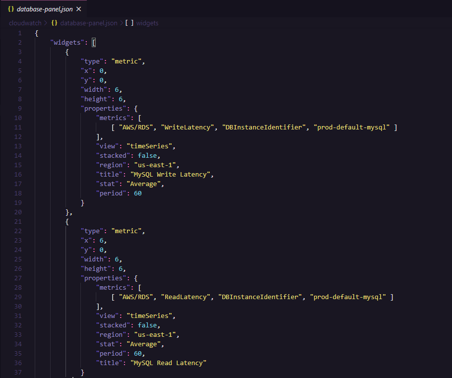

  
   
  <h1>Thiago Rocha</h1>
  Built with ❤︎ by
  <a href="https://github.com/thiagolizard">thiagolizard</a>
  

 

---

  

#  CloudFormation
I developed several CloudFormation models, because most of the time I've always worked with IaC (Infrastructure as code).
So, thinking about infrastructure automation, I developed a CloudFormation model for all the services I've already used in work or study.

**For example:**
| Template |Description  |
|--|--|
| [Network](https://github.com/thiagolizard/aws-resources/blob/master/cloudformation/network-template.yaml) | This model is a network model, developed in the industry standard, security standards and high availability (VPC, Subnets, ACLs, Security Groups, etc). |
| [Load Balancer](https://github.com/thiagolizard/aws-resources/blob/master/cloudformation/loadbalancer-template.yml) | This model is a load balancer (application) model, contains load balancer, target group, listeners and listeners rules (optional). |
| [Memcached](https://github.com/thiagolizard/aws-resources/blob/master/cloudformation/memcache-template.yml) | This template is a model of the ElasticCache service's Memcached caching system, it contains a Memcache cluster, where it is created for high availability (Multi-AZ) in the subnets you choose. |
| [Others](https://github.com/thiagolizard/aws-resources/tree/master/cloudformation) | See all templates on this repo |

---
#  AWS Lambda

What I learned most in the Cloud area, was that the automation of infrastructure and certain actions is very important.
So, I developed some lambda functions (usually they work with lambda triggers) that executed certain processes that I needed, automatically. Most of these functions were developed in Python 3.

   
  
   

You can see this functions [here](https://github.com/thiagolizard/aws-resources/tree/master/lambda)

---

#  Cloudwatch

And last but not least, CloudWatch.
This monitoring service is essential to any infrastructure that is created at AWS, so for my work and studies I have created my own panels (JSON).
Among them are monitoring panels for Web Applications (Load balancer, target groups, response time, number of requests, etc).
All panels are configured with the best monitoring metrics for each service!

   
  
   

You can see all panels [here](https://github.com/thiagolizard/aws-resources/tree/master/cloudwatch)

---
# So...
In this repository there are several other resources besides those mentioned above, so, explore!
